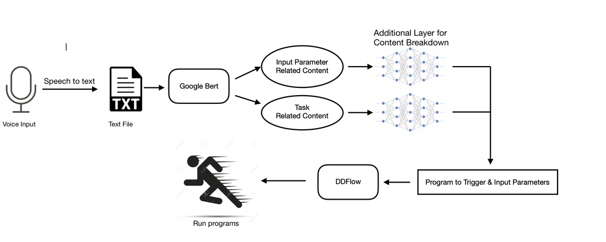

## Overview

The goal of this project is to enable a “digital assistant” system that listens to user commands and coordinates distributed applications spanning multiple devices including sensors/actuators.

## Goals

Baseline: a static set of macro-programs over a static set of devices.

Next phase: a static set of macro-programs over dynamic device set, along with parameter generation.

Stretch goal: dynamically “assemble” macro-programs (if have time).


## System Flowchart




## Specifications

| Hardware                                  | Software                      |
| -------                                   | --------                      |
|Computer Platform (Mac OS)                 | Python3                       |
|Potentially deployable to embedded systems | Natural Language Processing   |

## Milestones

### Baseline

Figure out practicable neural network implementations
```markdown
    Voice Input → Text → Statistical Correlation → Program Output
```
Map the program output to DDFlow input

### Next Phase

Based on phase 1, add parameter extraction function which provides parameter input for DDFlow Programs
```markdown
    Voice Input → Text → NN → Program output with feature parameters 
```
Map the program output and parameters to DDFlow input

### Stretch Goal

Variable parameters over the dynamic device set


## Reference Work
* Siri, Alexa, Google Assistant, Mobile Health
* DDFlow
