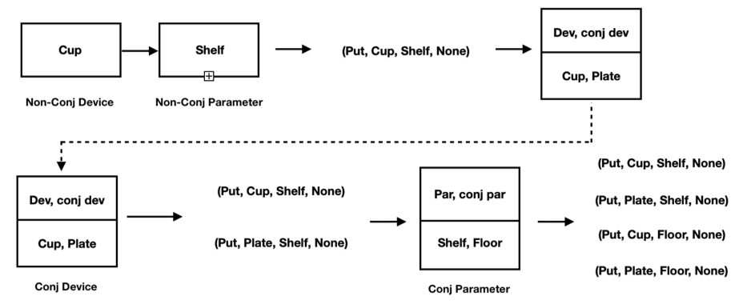
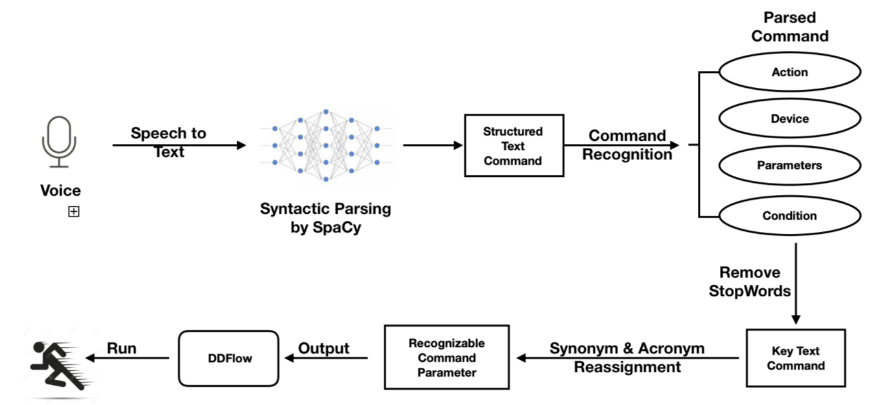
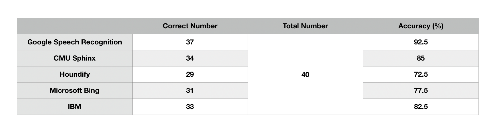
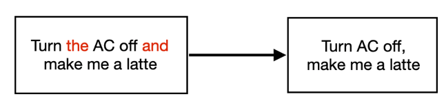
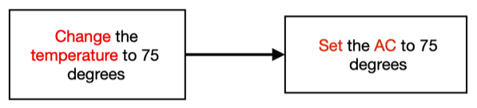
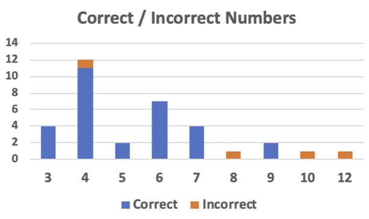
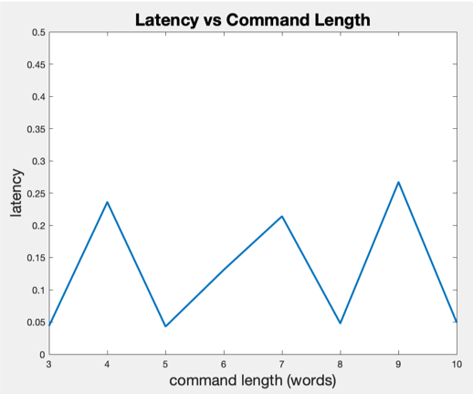

# Digital Distributed IoT Assistant

Eugene Chu 405219652  
Nicolas Cheng 905219471

## Abstract
With a variety of Internet of Things (IoT) spatially distributed in our environment, users often feel the need to interact with them more efficiently. We summarize a design space of interaction with different deivce and identify an underexplored area that inspires the design of DDIoTA --- a front end “digital assistant” system that listens to user's commands and coordinates distributed applications spanning multiple devices including sensors/actuators. We collected some real world commands that are commonly used in daily lives and used multiple models such as Bert[1], Flair[2] and NTLK[3] to process the command. In this report, we first introduce the background, goals and related works of this project, then we provide system design and technical approaches on how the command is processed. At last, we organize the potential future works and conclusion for this project.

## Introduction
### Background & Goals
A large number of spatially-distributed Internet of Things (IoT) has populated our living and work environments, motivating researchers to explore various interaction techniques. At present, the main interaction method with a majority of IoT assistants such as Amazon Alexa, Google Home and Apple Siri is through voice command. However, these interaction techniques are limited to a single command over a static device rather than a dynamic distribution on multiple devices. This brings plenty of inefficiency to interaction scenarios, as when a user attempts to make complex commands over a wide range of devices, there is no way for him to simply conduct a one-time command. Instead, he'd have to input those commands one at a time and suffer constant waitings.
  
  To solve this inefficient scenario, we present DDIoTA, an IoT assistant that could achieve macroprogramming over a dynamic set of devices. This project is based on some state-of-the-art models and neural networks. There are three major steps of this project:
  
**First**: identify the function that user is attempting to input and generate a list of parameter-less macro-programs. This step mainly aims at reconstructing the capability of Siri, which assumes that the device to be interact with is already known, and the system simply attempt to grasp the action on the device without any parameters or conditions. The following graph helps explaining how the first phase works: in this sentence, only two key elements can be grasped: *open* and *door*. After grasping those two key words, the system then simply put the word “open” in the *Action* position and put “door” in the *Device* position.

**Second**: Compared with the first phase, there are two main breakthroughs in the second phase. On one hand, from the input voice command, the system should be able to do a system structure analysis throughout the command and accurately grasp the four command output elements: *Action*, *Device/System*, *Parameter* and *Condition*. This is still within the capability of existing interaction techniques. On the other hand, if there are multiple intended commands within one sentence, the system is supposed to split out each individual command with the four elements (*Action*, *Device/System*, *Parameter* and *Condition*) and output these commands separately. For instance, in the example below, the system can process the input “Put the cup and plate on the shelf and floor.” into four output four-element tuples: (Put, Cup, Shelf, None), (Put, Plate, Shelf, None), (Put, Cup, Floor, None), (Put, Plate, Shelf, None). Note that there are no trigger conditions in this command, so the *Condition* element is left blank.

**Third**: The third phase is the one where the system dynamically assemble macro-programs across dynamic device sets. In this step, the user is no longer required to cover the details of each command. Instead, he would give a “condensed” command, and the system would extract key information from this command to determine which devices or systems to trigger and how the operation should be. For instance, when the user says a command “Catch the thief”, the system would first capture the keywords *catch* and *thief*, after which a series of text commands would be generated by the system automatically such as “initiate the camera at location xx”, “send drones to follow the thief” and “notify the police where the thief is”. After that, each text command would be processed and executed respectively to *dynamically* distributed macro-programs. 

Unfortunately, due to time limitation, we are only able to complete the first two phases and the third phase would need more time before it can be implemented. 

  
  
  
## Technical Background
  
  
  
  
  The application platform for the prototype of this system is DDFlow, an active research project that is being conducted by Joseph Noor. DDIoTA is a front-end program for DDflow, where command parsing and macro-program construction is done, while DDflow manages the dynamic, distributed device set. 

## System Design

The flowchart above illustrates the process of our work. As the user makes a voice input, it is first transcribed into text string by *Python SpeechRecognition Model*. Then using Spacy, which syntactically analyzes and parses the string, each word is represented by a token which not only includes what this word is, but also its relationships between other words in the command. The output of SpaCy-processed command is a structured command. Then the command goes through a extraction algorithm which generates a list of four-word tuples, each of which represents a parsed command. After that, stop words are removed from each command to make sure that only the key information is preserved. Lastly, a mapping between the parsed commands and available commands is applied. Mainly consists of *acronym* and *synonym* word replacement, this procedure guarantees that the parsed command can be understood by the executing programs. More details about how each step is implemented s introduced in the following **Technical Approach** section.

## Technical Approach

### Voice to text

To transfer voice command to text string, we use the **Python SpeechRecognition Model** [reference] with the **Google Speech API**. The performance of transcription is generally satisfying, with an accuracy of 92.5%. The accuracy of other APIs are also tested such as CMU Sphinx and Houndify, and their success rate of transcription varies between 71% to 85%. Below are the API comparison table using *Python SpeechRecognition Model*. 

### SpaCy
We utilize the SpaCy python module[4] for basic sentence structure analysis and dependency parsing. We chose SpaCy as it interoperates seamlessly with TensorFlow, PyTorch, scikit-learn, Gensim and the rest of Python's AI ecosystem, further simplfying tasks such as data format conversion and connection to downstream tasks in our pipeline. In this step, we input sentence commands in string format, where each word token is then annotated with it's corresponding Part-Of-Speech (POS) tagging as well as it's dependencies. This allows us to extract the relavant relationships between token pairs such as (NOUN,VERB) or (VERB, ADP) pairs, which are crucial in interpreting user commands. This 

### Command Generator
The syntax tree constructed by SpaCy is then passed on to our command generator. In this stage, we distinguish between `DEVICE NOUNS` and `PARAMETER NOUNS`, as well as `CONDITION ADPS` and `PARAMETER ADPS`. As SpaCy cannot achieve 100% accuracy in syntatic parsing, we've included our own optimizer within this stage to further improve our parsing strategy. 

During this stage, we feed in a `doc` object that encodes the original command sentence along with the annotated POS tags and dependencies. Our output is a `(ACTION, DEVICE, PARAMETER, CONDITION)` 4-tuple, which forms the basis for DDFlow's input parameters that can be directly fed into the corresponding devices. The elements in the tuple is defined as follows:*

- `ACTION`: The desired function to be activated. This element is limited to certain keywords in a LUT, dependent on the device (e.g. turn on/open ...etc.).
- `DEVICE`: The device that is to be called (e.g. the TV/the radio ...etc.). 
- `PARAMETER`: Any other parameters that provide further clarification on the command (e.g. on the floor/under the table ...etc.).
- `CONDITION`: Conditions that must be fulfilled before activating this command (e.g. if/when/once ...etc.).

We split this stage into the following 3 substages:

#### Stopword elimination
Since each device and function in downstream tasks have their own unique identification, we are able to remove certain unnecessary stopwords that result in better parsing accuracy. However, common stopword databases are not optimized for command parsing, and therefore remove many words that encode *function content*, such as prepositional phrases (PP), negation (Neg), particles (Par), and prepositions (P). These words/phrases are critical in retaining `PARAMETER` and `CONDITION` information, and cannot be removed. Therefore, we limit our stopword elimination to specific categories rather than full NLTK stopword databases.

#### Polyseme resolution
In this phase, we resolve polysemes with word embeddings, specifically **BERT Embeddings** (further explained below). Polysemes such as `on` often confuse SpaCy with their correct interpretation within the command, and therefore we use word embeddings to maintain accuracy (example below).

- Turn the lights *on*: on is a particle, meant to express a state of the action.
- Put the cup *on* your table: on is a preposition, meant as preposition for further clarification in the subclause.

With BERT embedding, we can resolve these complications and correctly parse the commands.

#### Conjugated nouns
In speech input, we often connect multiple commands together with conjugatives such as "and". These noun phrases are of either `DEVICE`s or `PARAMETER`s, and our program must be able to recognize these are equal yet distinct commands. We implement an algorithm that locates conjunction relationships between conjunct `DEVICE`s and conjunct `PARAMETER`s and duplicate commands for every (`DEVICE`,`CONJ_DEVICE`) and (`PARAMETER`, `CONJ_PARAMETER`) pair, as shown in the figure below:

### Flair/BERT
Flair [2] is a powerful, multilingual NLP library that includes many text and docment embedding techniques and models developed by [Zalando Research](https://research.zalando.com/). It is compatible with PyTorch as well as TensorFlow, which gives it simple interfaces that allow us to combine different word and document embeddings. In our project, we choose to use BERT embeddings developed by Google. BERT embeddings are based on a bidirectional transformer architecture with state-of-the-art performance in multiple NLP tasks, and it's unique "Whole Word Masking" training technique gives us accurate results in determining the meaning a particular word given it's neighboring words and sentence structure. We chose to pool the last 4 output layers as the final word embedding for similarity analysis.

### Synonym & Acronym

Because our system’s purpose is to convert voice to multiple commands in tuple form and feed those tuples to DDFlow, it is crucial that the output is understood-able by the DDFlow system. This brings in the necessity that when the command uses a word that DDFlow cannot comprehend, the command can be converted in a way within DDFlow’s comprehension capability. For instance, the operation `direct the TV channel to 75` may confuse DDFlow because it does not have an action *direct* for the device TV. Instead, the command word `switch` is available. In this scenario, introducing word substitution becomes essential. So far, we have come up with two kinds of word substitutions: `synonym` and `acronym`. First, we write a python dictionary simulating what devices/systems there are and what their available commands are respectively. If a command’s device element is not recognizable by the system, we would introduce the **Synonym & Acronym Handling** procedure. For acronym, if the device name consists of two or more words (e.g air conditioner), we simply take the first letter abbreviation and see if it matches any available registered device. Then if there’s still no matching, we would check whether the device name’s synonym list has anything in the available device list, and if there is any, we would replace the device element with that available device name. After that, the `ACTION` element goes through the same procedure. We use the python **NTLK Wordnet**[3] to achieve synonym list organization and word replacement.

One instance of **Synonym & Acronym Handling** is presented below:

## Result

A 41-command-included file is used for DDIoTA system verification. These commands are all acquired from popular **Siri** and **Alexa** popular command lists. The length of commands ranges from 3 to 12 words and desired output tuple-command number range from 1 to 4. The accuracy versus command length graph is shown below.

Out of the 41 commands, 37 are correctly processed by our system, which yields an accuracy of 92.5%. It is worth saying that most of the long commands are not correctly parsed, which suggests that when the command becomes lengthy, our system still suffers a hard time to accurately yield the output completely, although a partial of its output is accurate. But for shorter commands, it can already reach a high recognition accuracy.

The latency incurred by processing is shown below. We can observe that the latency does not vary much with the change of command length. This proves the stability of our system as the work to be done does not increase dramatically with the increasing complexity of input command. Generally, the latency stays between 0.05s to 0.25s, which performs like a real-time system. Nevertheless, for some rare cases, there exist latency spikes that could reach 1 to 1.5s. This may become an aspect that future work could pay attention to.

## Strength and Weakness
Currently, our program has low latency in parsing speech input and resolves the commands with acceptable accuracy. The program is also capable of customizing for new devices and functions, which is important for connecting to downstream tasks such as DDFlow.

However, current bottlenecks are located in sentence parsing, as punctuation is often integral in parsing sentence commands, yet are overlooked in speech to text translations. This may cause confusion in sentence structure, resulting in mis-parsed commands. Furthermore, we have observed poor performance in identifying nomenclatures, which are often identified as unknown words, rather than named entities by SpaCy. We believe that further specialized training for our language models may be necessary if our program is to be deployed on more niche environments.

## Future Works
As sentences often include multiple subclauses for `DEVICE`, `PARAMETER`, and `CONDITION`s, we wish to solve existing confusing cases, such as the word “with” for subclauses. We also look into dynamically “assembling” macro-programs that consist of multiple devices and actions with a single command, which gives further integration into DDFlow.

## Conclusion
We have contructed a program that allows users to more efficiently interact with the variety of IoT devices distributed in our environment. DDIoTA is a "digital assisant" that resolves vocal input into 4-tuple command parameters that correspond to extant devices and functions within our dynamic device set. We tested our program on commonly used commands in daily life and used state-of-the-art NLP models such as BERT[1] as well as syntatic parsing techniques in SpaCy[4] for command processing and generation. We can achieve 92.5% accuracy in decoding commands with multiple devices and actions, which is currently not possible with commerical digital assistants such as Apple Siri or Amazon Alexa. For our future work, we'll look into further fine-tuning our language and dependency parsing models for commands, which will improve our accuracy during command generation. Furthermore, we wish to refine our program for dynamic assembly of macro-programs with variable parameters, which will improve our integration into DDFlow.

## Demo Video  
The demo video can be found at:  
https://youtu.be/9DbU6AP8Yao

## Reference
[1] https://github.com/google-research/bert 

[2] https://github.com/zalandoresearch/flair 

[3] https://www.nltk.org

[4] https://spacy.io

